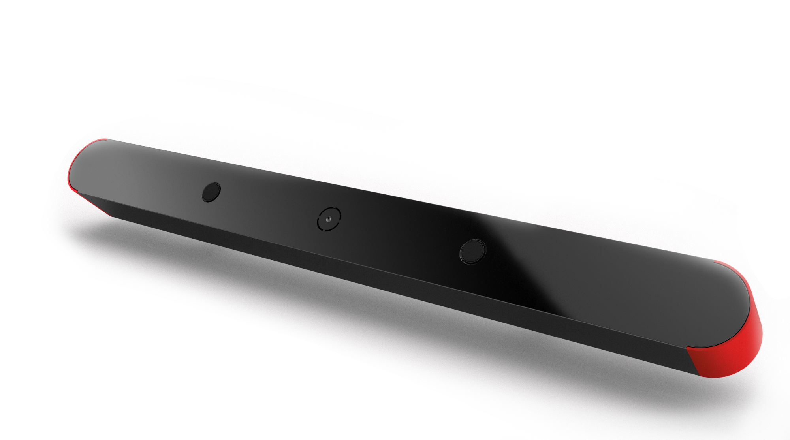
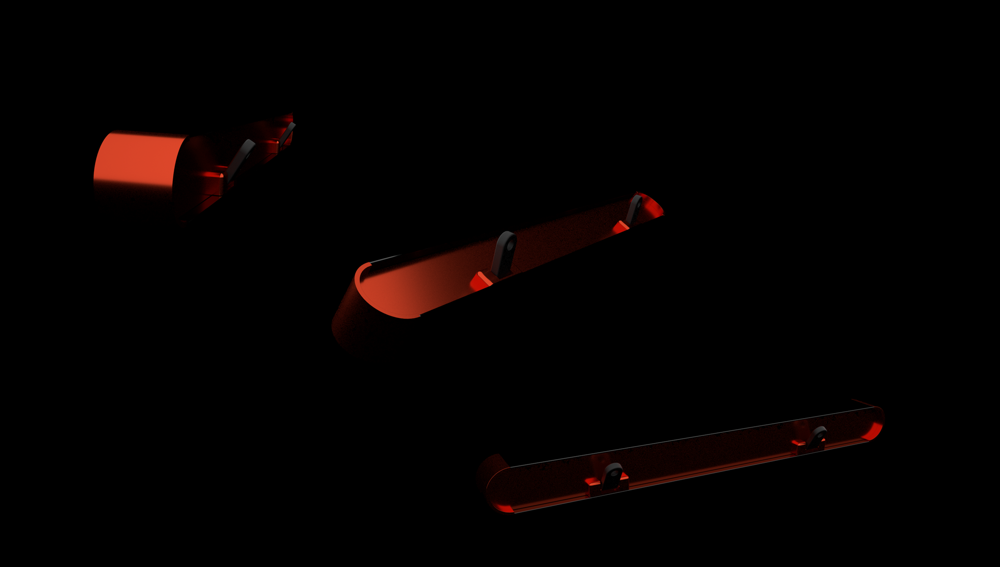
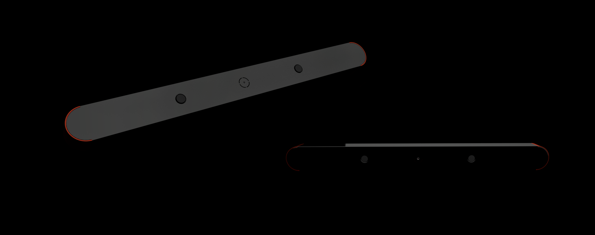

# Tailgate Buster
We built Tailgate Buster, to sense tailgating and prevent accidents.

According to figures from the National Highway Traffic Safety Administration (NHTSA), out of the 6 million car accidents that happen on U.S. roads every year, over 40% of them (2.5 million) are rear-end collisions.

On average, there is another rear-end collision every 8 seconds, which means that by the time you have read this far down there has already been one or two.

Tailgating is the leading cause of rear-end crashes with one-in-two drivers failing to keep a safe following distance, a new QUT report has revealed.

We are trying to reduce that, the active human behavior is to slow down when they see break lights, we built an IoT add-on to your llicense plate to flash you the red light to warn the tail gators when they get too close after going over 40 miles, if they do not stop, we will capture a video and store it in our database and share the data with insurance companies, which would result in premium increase in insurance.  7/11 accidents that happened to Google's auto drive was rear end accidents, Tailgate Buster can help reduce that.

# Team AI
Peter Ma - IoT tailgating detector, AI detection

Brian Cottrell - Web/Mobile App

Xiaobi (Iris) Pan - UI/UX Design, Industrial Design

Our deck can be viewed at 
https://docs.google.com/presentation/d/1OyHM0VFQi8pevPmodofPLgmWqNdF-mQWB6Of6JgRzls/edit?usp=sharing

# Code Structure
There are few pieces of the code here.
1) AI + IoT portion Portion, we used Ubuntu and Movidius NCS.  This requires you to download
https://github.com/movidius/ncsdk
https://github.com/movidius/ncappzoo
Using object detection to use Mobile-SSD-Net to launch inference with the Convolutional Neural Network to determine up to 20 subjects, we are specifically looking for Person and Cars.  This helps us to determine whether we should record the video.

2) Arduino portion
Arduino is rather simple, we place sonic ranger on D6, and backlight LED Display on I2C port of Arduino, the Ubuntu can can interact with it via test_arduino.py

3) License detection portion, pretty straight forward, we modified open sourcing project
https://github.com/MicrocontrollersAndMore/OpenCV_3_License_Plate_Recognition_Python

# Product Render

Iris design, and rendered the entire product during DV Mobility Hackathon

